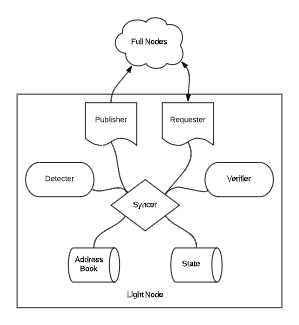

# ADR 002: Light Client

## Context

Here we describe the architecture for a Tendermint light node process in Rust,
including a core light client library. The purpose of the light node is to sync 
the blockchain in a light-weight manner, according to the Tendermint
light-client protocol.

The core light client library is built according to the
[english](https://github.com/tendermint/tendermint/blob/master/docs/spec/consensus/light-client.md) 
and
[TLA+](https://github.com/interchainio/verification/blob/develop/spec/light-client/Lightclient.tla)
specs (NOTE: both are still under development). Please read at least the english
spec for important context on this document. 

The light node process makes RPC requests for blockchain data from a list of
full nodes, uses the library to verify this data, and updates its state
accordingly. 

The light client library should also work in the context of IBC, a protocol for
communication between blockchains. In this case, instead of making RPC requests,
IBC-enabled blockchains would receive the relevant data in transactions and
would verify it using the same light client library. Thus the library should
abstract over the source of data.

While this document only covers the case of the light node, and not IBC,
it's important to have clear separation of concerns so that the library can be
reused in the IBC context. For more information on IBC, see the 
[spec repo](https://github.com/cosmos/ics),
especially the specifications for
[client
semantics](https://github.com/cosmos/ics/tree/master/spec/ics-002-client-semantics)
and [handler
interface](https://github.com/cosmos/ics/tree/master/spec/ics-025-handler-interface)

The light client operates primarily on data types that are already implemented
(headers, public keys, signatures, votes, etc.). The crux of the light
client is verifying validator sets by computing their merkle root, and verifying
commits by checking validator signatures. The particular data structures used by
Tendermint have considerably more features/functionality, much of which is not
needed for the light client protocol - hence the light client library should
abstract over it.

In addition to the core verification logic, the light node needs a way to
receive data from full nodes, to detect conflicting information, and to report
on conflicts. While there are many ways for a full node to provide bad
information, what we're really looking for is misbehaviour by the validators,
which is reflected in conflicting commits (ie. commits for different blocks at
the same height). 

In what follows we outline the following components of the light client software:

- core light client verification library and traits
- how Tendermint data-structures implement the core light client traits
- how a light node requests information from full nodes and detects conflicts

Note that the architecture of IBC is out of scope, suffice it to say that the
core libraries (ie. the verification library and the implementation of core
traits by the Tendermint types) will be re-usable by IBC.

## Decision

Below is a schematic of the components of a light node:



We take up the components of the diagram in term.

### State

The light node state contains the following:

- current height (H) - height for the next header we want to verify
- last header (H-1) - the last header we verified
- current validators (H) - validators for the height we want to verify (including all validator pubkeys and voting powers)

It also includes some configuration, which contains:

- trusting period
- initial list of full nodes
- method (sequential or skipping)
- trust level (if method==skipping)

The node is initialized with a trusted header for some height H-1
(call this header[H-1]), and a validator set for height H (call this vals[H]).

The node may be initialized by the user with only a height and header hash, and
proceed to request the full header and validator set from a full node. This
reduces the initialization burden on the user, and simplifies passing this
information into the process, but for the state to be properly initialized it
will need to get the correct header and validator set before starting the light
client syncing protocol.

The configuration contains an initial list of full nodes (peers).
For the sake of simplicity, one of the peers is selected as the "primary", while the
rest are considered "backups". Most of the data is downloaded from the primary,
and double checked against the backups.

The state is considered "expired" if the difference between the current time and
the time from the trusted header is greater than a configurable "trusting
period". If at any point the state is expired, the node should log an error and
exit - it's needs to be manually reset.


### Manager 

For lack of a better name. The Manager co-ordiantes the syncing and is the
highest level component. We consider two approaches to syncing the light node: sequential and skipping.

#### Sequential Sync

Inital state: 

    - time T
    - height H 
    - header[H-1]
    - vals[H]

Here we describe the happy path:

1) Request header[H], commit[H], and vals[H+1] from the primary, and check that they are well formed and from the correct height
2) Pass header[H], commit[H], vals[H], and vals[H+1] to the verification library, which will:

    - check that vals[H] and vals[H+1] are correctly reflected in header[H]
    - check that commit[H] is for header[H]
    - check that +2/3 of the validators correctly signed the hash of header[H]

3) Request header[H] from each of the backups and check that they match header[H] received from the primary
4) Update the state with header[H] and vals[H+1], and increment H
5) return to (1)

If (1) or (2) fails, mark the primary as bad and select a new peer to be the
primary.

If (3) returns a conflicting header, verify the header by requesting the
corresponding commit and running the verification of (2). If the verification
passes, there is a fork, and evidence should be published so the validators get
slashed. We leave the mechanics of evidence to a future document. For now, the
light client will just log an error and exit. If the verification fails, it
means the backup that provided the conflict is bad and should be removed.

#### Skipping Sync

Skipping sync is essentially the same as sequential, except for a few points:

- instead of verifying sequential headers, we attempt to "skip" ahead to the
  full node's most recent height
- skipping is only permitted if the validator set has not changed too much - ie.
  if +1/3 of the last trusted validator set has signed the commit for the height we're attempting to skip to
- if the validator set changes too much, we "bisect" the height space,
  attempting to skip to a lower height, recursively. 
- in the worst case, the bisection takes us to a sequential height

### Requester

The requester is simply a Tendermint RPC client. It makes requests to full
nodes. It uses the `/commit` and `/validators` endpoints to get signed headers
and validator sets for relevant heights. It may also use the `/status` endpoint
to get the latest height of the full node (for skipping verification). It 
uses the following trait (see below for definitions of the referenced types):

```rust
pub trait Requester {
    type SignedHeader: SignedHeader;
    type ValidatorSet: ValidatorSet;

    fn signed_header<H>(&self, h: H) -> Result<Self::SignedHeader, Error>
        where H: Into<Height>;

    fn validator_set<H>(&self, h: H) -> Result<Self::ValidatorSet, Error>
        where H: Into<Height>;
}
```

Note that trait uses `Into<Height>` which is a common idiom for the codebase.

### Detect

The detection module is for checking if any of the backup nodes
are reporting conflicting information. It requests headers from each backup node
and compares them with a verified header from the primary. If there is a
conflict, it attempts to verify the conflicting header via the verifier. If it
can be verified, it indicates an attack on the light clients that should be
punishable. The relevant information (ie. the two conflicting commits) are
passed to the publisher.

### Publisher

For now, the publisher just logs an error, writes the conflicting commits to a
file, and exits. We leave it to a future document to describe how this
information can actually be published to the blockchain so the validators can be
punished. Tendermint may need to expose a new RPC endpoint to facilitate this.

See related [Tendermint issue #3244](https://github.com/tendermint/tendermint/issues/3244).

### Address Book

For now this is a simple list of HTTPS addresses corresponding to full nodes
that the node connects to. One is randomly selected to be the primary, while
others serve as backups. It's essential that the light node connect to at least
one correct full node in order to detect conflicts in a timely fashion. We keep
this mechanism simple for now, but in the future a more advanced peer discovery
mechanism may be utilized.

### Verifier

Most of the light client logic resides in the verifier, where commits for a
header are actually verified. In order to abstract over all the data in the
Tendermint data structures, we use a set of traits that provide only the
information absolutely necessary for the light client. 

According to the specification, the key functionality the light client
verification requires is to determine the set of signers in a commit, and
to determine the voting power of those signers in another validator set.
Hence we can abstract over the lower-level detail of how signatures are
validated.

#### Header

A Header must contain a height, time, and the hashes of the current and next validator sets. 
It can be uniquely identified by its hash:

```rust
pub trait Header {
    fn height(&self) -> Height;
    fn bft_time(&self) -> Time;
    fn validators_hash(&self) -> Hash;
    fn next_validators_hash(&self) -> Hash;

    fn hash(&self) -> Hash;
}
```

#### Commit

A commit contains the underlying signatures from validators, typically in 
the form of votes, but from the perspective of the light client, 
we don't care about the signatures themselves.
We're only interested in knowing the total voting power from a given validator
set that signed for the given block. Hence we can abstract over underlying votes and
signatures and just expose a `voting_power_in`, as per the spec.

The `header_hash` indicates the header being committed to, 
and `vote_len` methods are for simple validity checks.

```rust
pub trait Commit {
    fn header_hash(&self) -> Hash;
    fn votes_len(&self) -> usize;

    fn voting_power_in<VS>(&self, vals: &VS) -> Result<u64, Error> 
        where VS: ValidatorSet;
}
```

By abstracting over the underlying vote type, this trait can support
optimizations like batch verification, and changes to the
underlying commit structure, like using agreggate signatures instead of
individual votes. So long as it can be determined what voting power of a given validator set
signed correctly for the commit.

The method `voting_power_in` performs the underlying signature verifications.
It should return an error if any of them fail or are for the wrong header hash.

Note the specification introduces a `signers(commit) -> validators` method that
returns the list of validators that signed a commit. However, such a method
would require access to the underlying validator set in order to verify the
commits, and it is only ever used in computing `voting_power_in`. Hence, we
dispence with it here in favour of a `voting_power_in` that operates on a
`Commit` and `ValidatorSet`. However, this also means that ValidatorSet will
need to expose facilities for determining wheter a validator signed correctly in
order for implementations to make use of it to compute `voting_power_in`.

Note also that in Tendermint, commits are for a particular block ID, which
includes both a header hash and a "parts set hash". The latter is completely
irelevant to the light client, and can only be verified by downloading the full
block. Hence it is effectively ignored here. It would be great if Tendermint
could disentangle commits to the proposal block parts for gossip (ie. the parts
set hash) from commits to the header itself (ie. the header hash), but that's
left for the future.


For more background on implementation of Tendermint commits and votes, see:
- [ADR-025](https://github.com/tendermint/tendermint/blob/master/docs/architecture/adr-025-commit.md)
- [Validator Signing Spec](https://github.com/tendermint/tendermint/blob/master/docs/spec/consensus/signing.md)
- [Tendermint consensus specification](https://arxiv.org/abs/1807.04938)

#### Validator Set

A validator set has a unique hash which must match what's in the header.
It exposes a length which should match the commit's `vote_len`. It also has a
total power used for determining if the result of `voting_power_in` is greater
than a fraction of the total power. 

Most importantly, a validator set trait must facilitate computing `voting_power_in` 
for a Commit, which means it needs to expose some way to determine the voting power 
of the validators that signed. Note, however, that this functionality is not used 
by the light client logic itself - it's only used by the implementation of
Commit within the `voting_power_in` method. Hence, further abstraction may be
warranted to eliminate the need for such a method. For instance, perhaps
ValidatorSet could be an associated type of Commit, and then implementations of
Commit would specify their ValidatorSet and how they verify signatures.

In the meantime, we use a ValidatorSet trait that exposes a lookup method 
for fetching validators by their Id. An associated validator type (below) can then expose 
it's voting power and a method for verifying signatures. Implementations of Commit can use this to
determine the voting power of the validators that signed. 

```rust
pub trait ValidatorSet {
    type Validator: Validator;

    fn hash(&self) -> Hash;
    fn total_power(&self) -> u64;
    fn len(&self) -> usize;

    fn validator(&self, val_id: Id) -> Option<Self::Validator>;
}
```

Note that this also assumes `Commit` has access to the Id of the validators that
signed. This is presently true, since Commit's contain the validator addresses
along with the signatures. But if the addresses were removed, for instance to
save space, the Commit trait would need access to the relevant validator set to 
get the Ids, and this validator set may be different than the one being passed
in `voting_power_in`! This again suggests the need for a better abstraction, and
more closely associating the validator lookup and signature verification
functionality with the Commit trait.

#### Validator

A validator contributes a positive voting power if a message was correctly
signed by it, otherwise it contributes 0. We could represent this with a single
method that returns either 0 or the voting power, but it's probably clearer with
two methods:

```rust
pub trait Validator {
    fn power(&self) -> u64;
    fn verify_signature(&self, sign_bytes: &[u8], signature: &[u8]) -> bool;
}
```

This trait is needed for the validator lookup method in the ValidatorSet, but as
per the note above, if that method can be eliminated, so can this trait.

### State

According the spec, the light client is expected to have a store that it can
persist trusted headers and validators to. This is necessary to fetch the last trusted
validators to be used in verifying a new header, but it's also needed in case
any conflicting commits are discovered and they need to be published to the
blockchain. While it's not needed for the core verification, which can be
assumed pure, it is needed for a fully working client. Hence we introduce 
additional traits:


```rust
pub trait SignedHeader {
    type Header: Header;
    type Commit: Commit;
    
    fn header(&self) -> &Self::Header;
    fn commit(&self) -> &Self::Commit;
}

pub trait TrustedState {
    type LastHeader: SignedHeader; 
    type ValidatorSet: ValidatorSet;

    fn new(last_header: Self::LastHeader, vals: Self::ValidatorSet) -> Self;
    
    fn last_header(&self) -> &Self::LastHeader; // height H-1
    fn validators(&self) -> &Self::ValidatorSet; // height H
}

pub trait Store {
    type State: TrustedState;

    fn add(&mut self, state: &Self::State) -> Result<(), Error>;
    fn get(&mut self, h: Height) -> Result<&Self::State, Error>;
}
```

Here the trusted state combines both the signed header and the validator set,
and the store persists it all together under the relevant height.


### Implementing Traits

The tendermint-rs library includes Header, Vote, Validator, ValidatorSet, and
Commit data types. However, rather than use these types directly, the light 
client library is written more abstractly to use traits that contain only the
necessary information and functionality from these more concrete types. While this may turn out to
be an unecessarily eager abstraction (as we do not forsee alternative
implementations of these traits in the short term), it does provide a very clear
depiction of what is required for light client verification, and surfaces certain
design issues in the underlying Tendermint blockchain (eg. the `BlockID` issue
referenced above).

This abstraction may also facilitate testing, as we will not need to
generate complete Tendermint data structures to test the light client logic, only
the elements it cares about. While this provides a lot of flexibility in mocking out
the types, we must be careful to ensure they match the semantics of the actual
Tendermint types, and that we still test the verification logic sufficiently for
the actual types.

### Verification

Verification comes in two forms: full verification and "trusting" verification.
The former checks whether the commit was correctly signed by its validator set.
The latter checks whether +1/3 of a trusted validator set from the past signed a
future commit.

#### Full Verification

Since we know the validators for a commit,
we can check that the number of validators matches the number of votes in the commit.
In this case, `voting_power_in` uses a validator set that is the same as the one
that created the commit.

So we can have a function like:

```rust
fn verify_commit_full<V, C>(vals: V, commit: C) -> Result<(), Error>
where
    V: ValidatorSet,
    C: Commit,
{
```

#### "Trusting" Verification

To do skipping verification (ie. the "trusting method"), 
we have to check if +1/3 of validators at some past height signed the commit, 
before we can check if +2/3 of the validators for the current height signed.
However, as per the spec, we also add a `trust_level` to the +1/3, to modulate 
how willing we are to skip, potentially requiring even more than +1/3.

So we can have a function like:

```rust
fn verify_commit_trusting<V, C, L>(vals: V, commit: C, trust_level: L) -> Result<(), Error>
where
    V: ValidatorSet,
    C: Commit,
    L: TrustThreshold,
{
```

In this case, `voting_power_in` uses a validator set that is distinct from the
one that actually created the commit. Specifically, it uses the last trusted
validator set, and attempts to see if we can trust the new validator set.

If this function passes, then we can trust the new validator set, and we can 
call `verify_commit_full` with the new (and now correct) validator set to determine 
if they signed correctly.

Note we introduce the `TrustThreshold` trait, which exposes a single method
`is_enough_power(&self, signed_voting_power: u64, total_voting_power: u64)` with
a default implementation that returns `signed_voting_power * 3 >
total_voting_power` (ie. +1/3).

#### Validation

Most of the above is about checking the signatures and voting power in commits, 
but we also need to perform other validation checks, 
like that the validator set hashes match what are in the header, and the light
client's trusted state actually hasn't expired. Pure functions for all of these
checks should be provided.

Some things are left explicitly unvalidated as they have minimal bearing on the correctness of the light client.
These include:

- LastCommitHash
	- In the skipping case, it's not possible to verify the header refers to the correct previous block without reverting to the sequential case. So in the sequential case, we don't validate this either. If it's incorrect, in indicates the validators are misbehaving, though we can only detect it as a light client if there's a fork.
- BlockID
	- As mentioned, this includes a merkle root of the entire block and is not verifiable without downloading the whole block, which would defeat the purpose of the light client!
- Time
	- Verifying the time would require us to download the commit for the previous block, and to take the median of the timestamps from that commit. This would add significant overhead to the light client (an extra commit to validate for every block!). If the time is incorrect, in indicates that the validators are explicitly violating the protocol rules in a detectable way which full nodes should detect in the first place and shouldn't forward to light clients, so there would probably be bigger issues at foot.

There are likely a few other instances of things the light client is not validating that it in theory could but likely indicate some larger problem afoot that the client can't do anything about anyways. Hence we really only focus on the correctness of commits and validator sets and detecting forks!

### Lite Node Sync

Finally, to put it all together, we define a `verify_header` function which
attempts to sync to some given height:

```rust
pub fn verify_header<TS, SH, VS, L, S, R>(
    height: Height, trust_threshold: &L, trusting_period: &Duration,
    now: &SystemTime, req: &R, store: &mut S,
) -> Result<(), Error>
where
    TS: TrustedState<LastHeader = SH, ValidatorSet = VS>,
    SH: SignedHeader,
    VS: ValidatorSet,
    L: TrustThreshold,
    S: Store<State = TS>,
    R: Requester<SignedHeader = SH, ValidatorSet = VS>,
{
```

This function gets the latest state from the store, fetches the header for the
given height from a peer, and attempts to verify the header using the skipping
method, and running a bisection algorithm to recursively request headers of
lower height as needed. Every time it verifies a header, it updates the store.

As new headers are added to the store, we need to alert the detection module, so
it can start searching for conflicts. The coupling between the verification and
detection modules should be minimized. For now, we may assume the detection
module continuously polls the store for new headers, but in the future we may
use more explicit communication eg. via a channel.

Note this function is specific to the light node (rather than IBC) as it
implements the bisection algorithm directly and assumes the client has the
ability to make requests (where in the IBC case, we do not).

## Status

Proposed

## Consequences

### Positive

- Implements the light node!
- Simple peering strategy
- Clear separation between verification logic and the actual data types

### Negative

- Abstract traits requires more coding, more opportunity for bugs in trait implementation

### Neutral

- Certain validity checks are ommitted since they have little bearing
