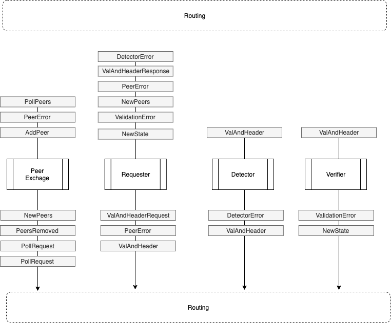

# ADR 006: Light Client Concurrency

## Changelog
- 2020-03-15: Initial draft.

## Context

The light client protocol provides a method for verifying application
state without the execution of all preceding transactions. The
protocol for the light client is described in
[English](https://github.com/tendermint/spec/tree/bucky/light-reorg/spec/consensus/light)
while the rust implementation is described in
[ADR-002](adr-002-light-client-adr-index.md). This ADR outlines the
next iteration of the light client implementation in rust in which
multiple modules (Peer Exchange, Requester, Verifier, etc) operate
concurrently.

The basis for this work comes from the learnings of the [Reactor
Experiments](https://github.com/informalsystems/reactor-experiments) as
well as the [Blockchain Reactor
Refactor](https://github.com/tendermint/tendermint/blob/master/docs/architecture/adr-043-blockchain-riri-org.md). The key take aways from that work are:

1. Communicate with events and not state
2. Separate concerns into independently verifiable (by humans as well as
   computers) components.
3. Push IO to the edge of the system to allow simulation of components
   as well as integration between components.

## Decision

Model the Peer Exchange, Requester, Detector and Verifier as separate
independently verifiable components. Each component is a finite state
machine with internal state. Communication between components is done by
event dispatching to a routing layer. The routing layer handles input
and output by routing to/from peers to components and between
components. The routing layer will provide the necessary abstraction to
allow simulation of individual components as well as integration between
components and peers.

This architecture outlines components that have been 
described in previous ADRs and will only be expanded upon here.

### Peer Exchange
The light clients requires an expanding set of peers to get headers
from. The larger and more diverse the set of peers; the better the
chances that the light client will detect a fork. The peer list can be
seeded with peers from configuration and will can crawl the network.

### Requester
The light client requests validator sets and signed headers from peers.
The order of data requested from peers is determined by the specific verification
algorithm being followed. Specifically either sequential or bisection.
Additionally the Requester is expected to request signed header for a
specific height from different peers in order to detect forks. The
current documentation refers to a primary and set of backup node
but it will be beneficial to fetch the requisite data from multiple peers
concurrently. In this way the Requester acts as a request scheduling
finite state machine informed by feedback from peers as well as other
components.

### Detector

The detector component will accumulate headers received from peers and
be responsible for detecting forks according to the (under active
development) [Fork Detection
Specification](https://github.com/tendermint/spec/blob/6b9e2ac9978bb647bc5f545345b189897d21b4c5/spec/consensus/light-client/detection.md). 

### Verifier

The verifier will perform the core [verificaiton
protocol](https://github.com/tendermint/spec/blob/master/spec/consensus/light-client/verification.md)
without performing IO. Essentially will use `VerifySingle` function in
the spec and communicate failure via events to the Requester to decide
which header to process next.

### Routing

The routing layer will route events based on type between components
similar to [previous
experiments](https://github.com/informalsystems/reactor-experiments/blob/1313bae50a2d642c9d401ea51a8cd53162f5290b/singlethreaded/nonblocking/src/seed_node.rs#L113). Messages to and from peers will be handled via a minimal peer layer wrapping the RPC client.

## Status

Proposed

## Consequences

### Positive
- Better isolation of concerns
- Parallelism can be handled by dispatching to a thread pool without changing the interface between components.

### Negative
- Non shared state means some state will be replicated. ie. the peer
  exchange component will have a list of peers. That list of peers also
  be represented in the peer to peer layer.

### Neutral
- Inconsistencies between state representations must be handled
  explicitly instead of implicitly. In the case above, we must consider
  that we have the address of peer which is off-line.

## References

* {reference link}
