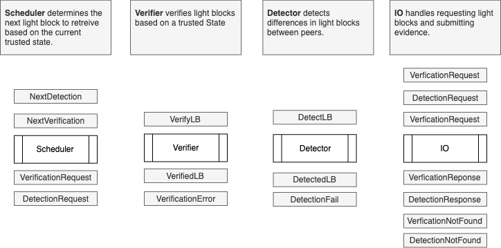
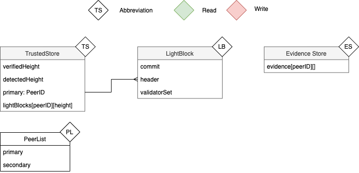
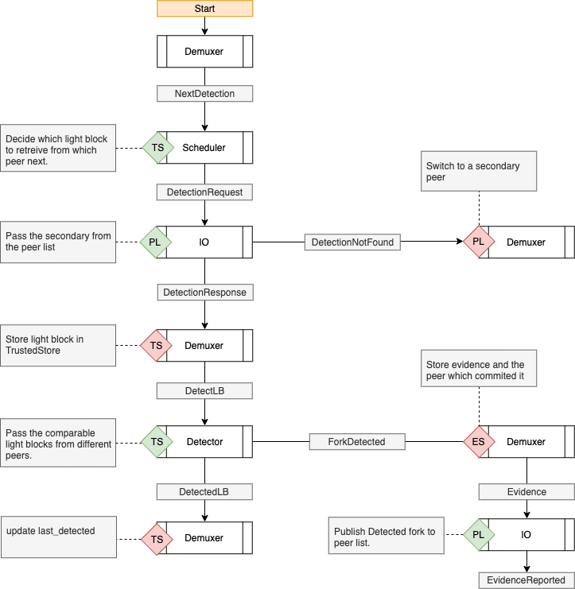

# ADR 006: Light Client Refactor

## Changelog
- 2020-03-15: Initial draft
- 2020-03-23: New decomposition

## Context

The light client protocol provides a method for verifying application
state without the execution of all preceding transactions. The
protocol for the light client is described in
[English](https://github.com/tendermint/spec/tree/bucky/light-reorg/spec/consensus/light)
while the rust implementation is described in
[ADR-002](adr-002-light-client-adr-index.md). This ADR outlines the
next iteration of the light client implementation in rust in which
multiple modules (Peer Exchange, Requester, Verifier, etc.) operate
concurrently.

The basis for this work comes from the learnings of the [Reactor
Experiments](https://github.com/informalsystems/reactor-experiments) as
well as the [Blockchain Reactor
Refactor](https://github.com/tendermint/tendermint/blob/master/docs/architecture/adr-043-blockchain-riri-org.md). The key take aways from that work are:

1. Separate concerns into independently verifiable (by humans as well as
   computers) components.
2. Deterministic functions wherever possible
3. Use events to index parameters of component function executions to
   maintain alignment between specs and implementations.

## Decision

Model the Scheduler ,Verifier, Detector and IO as separate
independently verifiable components. Communication between components is
done by a demuxer component which ownes state and dispatches events
between business logic executing components. Business logic is executed
as a synchronous deterministic function. The composition of components
can also be executed as a deterministic function.

### State
The light client maintains state about commit/header/validators abbreviated as LightBlocks. It also has state pertaining to peers and evidence.

### Verification Flow
The flow of events and mutations on state necessary for verification.

### Detection Flow
The flow of events and mutations on state necessary for fork detection.

### Events & State
There has been a notable change in thinking here. The previous version
of this ADR was built on the tenet of `communicate through events and
not through state`. The motivation being to serialize mutations
to state using event loops for deterministic simulation. The problem
with this approach is that it required components to replicate state.
For instance if the detector and the verifier both needed a store of
light blocks, we would need to:

* Replicate that state in memory
* Produce flows of events to populate both representations
* Deal with inconsistencies between representations.

The new approach shares state by `lending` read only access to state
for duration of the synchronous and deterministic execution of the sub
component (ie. verifier, detector). The result of the execution is an
event which then the owner can use to mutate the state accordingly.
This way state mutation are serialized (deterministic) even if they are
temporarily shared by separate components.

### Concurrency

No concurrency for now. We have some ideas of how to handle concurrency
within this architecture that will be handled a separate ADR.

## Status

Proposed

## Consequences

### Positive
- Better Isolation of Concerns
- Deterministic Testing of the composition of components.
- No async functions

### Negative

### Neutral

## References

* [Light Client Spec](https://github.com/tendermint/spec/tree/bucky/light-reorg/spec/consensus/light)
* [Blockchain Reactor Refactor](https://github.com/tendermint/tendermint/blob/master/docs/architecture/adr-043-blockchain-riri-org.md)
* [Reactor Experiments](https://github.com/informalsystems/reactor-experiments)
