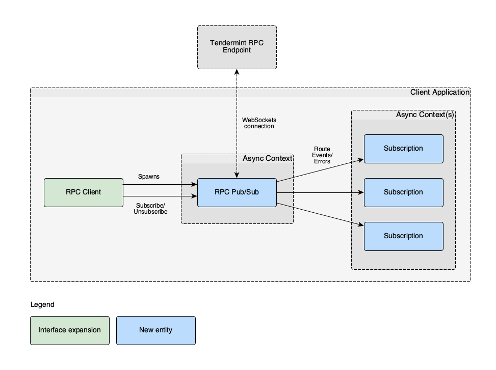

# ADR 008: RPC Client Event Subscription Mechanism

## Changelog

* 2020-07-23: Initial draft

## Context

The [Tendermint Light Client](../../light-client/) is one of many important
applications that will make use of the [RPC client](../../rpc/) to query
Tendermint full nodes for information relating to the blockchain.

Tendermint servers (e.g. full nodes) provide an [event
subscription][tm-event-subs] RPC endpoint to allow clients to receive
notifications of specific events as they happen (currently via a WebSockets
connection). We need to expose this subscription mechanism through the RPC client.

In order to achieve this, we need:

1. An ergonomic interface for the RPC client that allows developers to subscribe
   to events produced by specific queries. Specifically, this interface must:
   1. Offer **subscription** functionality, where:
      1. A single **subscription** takes place to the **events** produced by a
         **query** (the [PEG] for which, at the time of this writing, is located
         [here][query-peg]).
      2. Callers must be able to create multiple distinct subscriptions.
      3. A subscription must offer an interface to allow for iteration over
         incoming events only relevant to that subscription (i.e. it should
         produce an **event stream**).
      4. It must be possible to, from outside of the RPC client, receive events
         from multiple subscriptions' event streams concurrently without
         interfering with/blocking each other.
      5. It must be possible to, from outside of the RPC client, handle
         subscriptions' event streams without blocking other RPC operations.
   2. Offer the ability to **unsubscribe** from specific queries (i.e. to
      terminate specific subscriptions).
2. An appropriate concurrency model for drivers of the transport layer that
   allows the transport layer to operate independently of consumers of
   subscriptions.

## Decision

### Assumptions

* All blocking operations that deal with I/O must be `async`
* We will not be ["de-asyncifying" the RPC][issue-318] and will rather, in a
  future ADR, propose a synchronous architecture as well should we need one.

### Proposed Entities and Relationships

The entities in the diagram below are described in the following subsections.
The diagram also gives some indication as to the proposed concurrency model for
the architecture and how the entities relate to each other.



### Subscription

A `Subscription` here is envisaged as an entity that implements the
[Stream][futures-stream] trait, allowing its owner to asynchronously iterate
through all of the relevant incoming events. Use of such a subscription should
be as simple as:

```rust
while let Some(result_event) = subscription.next().await {
   match result_event {
      Ok(event) => { /* handle event */ },
      Err(e) => { /* terminate subscription and report error */ },
   }
}
```

### Client Model

In certain cases, consumers of the Tendermint RPC client library may not want to
make use of subscription functionality. Since such functionality comes with
additional overhead in terms of resource usage and asynchronous task management,
it would be optimal to define two different kinds of clients:

1. A **minimal client**, that allows for interaction with all RPC endpoints
   except those pertaining to subscription management. In our current
   implementation, this client would only interact via the HTTP RPC endpoints.
2. A **full client**, that provides access to *all* RPC endpoints, including
   subscription functionality. In our current implementation, this client would
   interact via the HTTP RPC endpoints for all types of requests except for
   subscription, where it will use a WebSocket connection instead.

The interfaces of the two types of clients are envisaged as follows.

#### Minimal Client

```rust
pub type Result<R> = std::result::Result<R, Error>;

/// The primary methods to be implemented are just the `perform` and `close`
/// methods. All other methods are just convenience interfaces to `perform`.
pub trait MinimalClient {
    /// `/abci_info`: get information about the ABCI application.
    async fn abci_info(&self) -> Result<abci_info::AbciInfo> {
        Ok(self.perform(abci_info::Request).await?.response)
    }

    /// `/abci_query`: query the ABCI application
    async fn abci_query<V>(
        &self,
        path: Option<abci::Path>,
        data: V,
        height: Option<Height>,
        prove: bool,
    ) -> Result<abci_query::AbciQuery>
    where
        V: Into<Vec<u8>> + Send,
    {
        Ok(self
            .perform(abci_query::Request::new(path, data, height, prove))
            .await?
            .response)
    }

    /// `/block`: get block at a given height.
    async fn block<H>(&self, height: H) -> Result<block::Response>
    where
        H: Into<Height> + Send,
    {
        self.perform(block::Request::new(height.into())).await
    }

    /// `/block`: get the latest block.
    async fn latest_block(&self) -> Result<block::Response> {
        self.perform(block::Request::default()).await
    }

    /// `/block_results`: get ABCI results for a block at a particular height.
    async fn block_results<H>(&self, height: H) -> Result<block_results::Response>
    where
        H: Into<Height> + Send,
    {
        self.perform(block_results::Request::new(height.into()))
            .await
    }

    /// `/block_results`: get ABCI results for the latest block.
    async fn latest_block_results(&self) -> Result<block_results::Response> {
        self.perform(block_results::Request::default()).await
    }

    /// `/blockchain`: get block headers for `min` <= `height` <= `max`.
    ///
    /// Block headers are returned in descending order (highest first).
    ///
    /// Returns at most 20 items.
    async fn blockchain<H>(&self, min: H, max: H) -> Result<blockchain::Response>
    where
        H: Into<Height> + Send,
    {
        // TODO(tarcieri): return errors for invalid params before making request?
        self.perform(blockchain::Request::new(min.into(), max.into()))
            .await
    }

    /// `/broadcast_tx_async`: broadcast a transaction, returning immediately.
    async fn broadcast_tx_async(&self, tx: Transaction) -> Result<broadcast::tx_async::Response> {
        self.perform(broadcast::tx_async::Request::new(tx)).await
    }

    /// `/broadcast_tx_sync`: broadcast a transaction, returning the response
    /// from `CheckTx`.
    async fn broadcast_tx_sync(&self, tx: Transaction) -> Result<broadcast::tx_sync::Response> {
        self.perform(broadcast::tx_sync::Request::new(tx)).await
    }

    /// `/broadcast_tx_sync`: broadcast a transaction, returning the response
    /// from `CheckTx`.
    async fn broadcast_tx_commit(&self, tx: Transaction) -> Result<broadcast::tx_commit::Response> {
        self.perform(broadcast::tx_commit::Request::new(tx)).await
    }

    /// `/commit`: get block commit at a given height.
    async fn commit<H>(&self, height: H) -> Result<commit::Response>
    where
        H: Into<Height> + Send,
    {
        self.perform(commit::Request::new(height.into())).await
    }

    /// `/validators`: get validators a given height.
    async fn validators<H>(&self, height: H) -> Result<validators::Response>
    where
        H: Into<Height> + Send,
    {
        self.perform(validators::Request::new(height.into())).await
    }

    /// `/commit`: get the latest block commit
    async fn latest_commit(&self) -> Result<commit::Response> {
        self.perform(commit::Request::default()).await
    }

    /// `/health`: get node health.
    ///
    /// Returns empty result (200 OK) on success, no response in case of an error.
    async fn health(&self) -> Result<()> {
        self.perform(health::Request).await?;
        Ok(())
    }

    /// `/genesis`: get genesis file.
    async fn genesis(&self) -> Result<Genesis> {
        Ok(self.perform(genesis::Request).await?.genesis)
    }

    /// `/net_info`: obtain information about P2P and other network connections.
    async fn net_info(&self) -> Result<net_info::Response> {
        self.perform(net_info::Request).await
    }

    /// `/status`: get Tendermint status including node info, pubkey, latest
    /// block hash, app hash, block height and time.
    async fn status(&self) -> Result<status::Response> {
        self.perform(status::Request).await
    }

    /// `/broadcast_evidence`: broadcast an evidence.
    async fn broadcast_evidence(&self, e: Evidence) -> Result<evidence::Response> {
        self.perform(evidence::Request::new(e)).await
    }

    /// Perform a request against the RPC endpoint
    async fn perform<R>(&self, request: R) -> Result<R::Response>
    where
        R: Request;

    /// Gracefully terminate the underlying connection (if relevant - depends
    /// on the underlying transport).
    async fn close(self) -> Result<()>;
}
```

#### Full Client

```rust
pub trait FullClient: MinimalClient {
    /// `/subscribe`: subscribe to receive events produced by the given query,
    /// but specify how many event results can be buffered in the resulting
    /// subscription.
    async fn subscribe_with_buf_size(
        &mut self,
        query: String,
        buf_size: usize,
    ) -> Result<Subscription>;

    /// `/subscribe`: subscribe to receive events produced by the given query.
    async fn subscribe(&mut self, query: String) -> Result<Subscription> {
        self.subscribe_with_buf_size(query, DEFAULT_SUBSCRIPTION_BUF_SIZE)
            .await
    }

    /// `/unsubscribe`: unsubscribe from receiving events for the given
    /// subscription.
    ///
    /// This terminates the given subscription and consumes it, since it is no
    /// longer usable.
    async fn unsubscribe(&mut self, subscription: Subscription) -> Result<()>;
}
```

### Transport Driver

Depending on the underlying transport, a client may need a **transport driver**
running in an asynchronous context. As in the example of a WebSocket connection,
the rate at which one interacts with the WebSocket connection may differ to the
rate at which one interacts with `Event`s being produced by a `Subscription`, so
they necessarily need to run concurrently in different contexts.

Implementation of such a transport driver is transport-specific. Short-lived
request/response interactions (such as HTTP) would not require such a transport
driver, whereas a WebSocket connection would.

### Inter-Task Communication

Wherever there are asynchronous tasks communicating with each other, it is
recommended to make use of [Tokio's synchronization primitives][tokio-sync].
These come with the downside that, once one has selected a buffer size for a
fixed-sized channel, one cannot alter that buffer size, and so buffer size
selection becomes a challenge.

Unfortunately, since the difference in the event processing rate (by the client)
and event receive rate (from the remote node) is application-specific, tuning
this parameter also becomes an application-specific concern.

### Query Interface

It is proposed that, using a *builder pattern*, we implement a subscription
`Query` interface that implements the full [query PEG][query-peg] provided by
the Go implementation of the RPC client. This would allow for compile-time
validation of queries.

The desired interface for constructing a query would look as follows:

```rust
// tm.event='NewBlock'
let query = Query::from(EventType::NewBlock);

// tm.event='Tx' AND tx.hash='XYZ'
let query = Query::from(EventType::Tx).and_eq("tx.hash", "XYZ");

// tm.event='Tx' AND tx.height=5
let query = Query::from(EventType::Tx).and_eq("tx.height", 5);
```

This interface could be implemented along the following lines.

```rust
// Query would only have constructors that either specified an event type
// (corresponding to a `tm.event='eventtype'` query) or a condition. There must
// be no constructor that allows for construction of an empty query.
pub struct Query {
    // A query can only match zero or one type of event.
    event_type: Option<EventType>,
    // A query can contain zero or more conditions.
    conditions: Vec<Condition>,
}

impl From<EventType> for Query {
    fn from(event_type: EventType) -> Self {
        Self {
            event_type: Some(event_type),
            conditions: Vec::new(),
        }
    }
}

impl Query {
    // An example of a constructor for `Operation::Eq`.
    pub fn eq(key: &str, value: impl Into<Operand>) -> Self {
        Self {
            event_type: None,
            conditions: vec![Condition::new(key, Operation::Eq(value.into()))],
        }
    }

    // ...

    // Allows for a simple builder pattern.
    pub fn and_eq(mut self, key: &str, value: impl Into<Operand>) -> Self {
        self.conditions.push(Condition::new(key, Operation::Eq(value.into())));
        self
    }

    // ...
}

// Derived from https://github.com/tendermint/tendermint/blob/master/types/events.go
pub enum EventType {
    NewBlock,
    NewBlockHeader,
    NewEvidence,
    Tx,
    ValidatorSetUpdates,
    CompleteProposal,
    Lock,
    NewRound,
    NewRoundStep,
    Polka,
    Relock,
    TimeoutPropose,
    TimeoutWait,
    Unlock,
    ValidBlock,
    Vote,
}

pub struct Condition {
    key: String,
    op: Operation,
}

pub enum Operation {
    Eq(Operand),
    Lt(Operand),
    Lte(Operand),
    Gt(Operand),
    Gte(Operand),
    Contains(Operand),
    Exists,
}

// According to https://docs.tendermint.com/master/rpc/#/Websocket/subscribe,
// an operand can be a string, number, date or time. We differentiate here
// between integer and floating point numbers.
pub enum Operand {
    String(String),
    Integer(i64),
    Float(f64),
    Date(chrono::Date),
    DateTime(chrono::DateTime),
}
```

## Status

Proposed

## Consequences

### Positive

* Provides relatively intuitive developer ergonomics (`Subscription` iteration
  to produce `Event`s).
* `MinimalClient` and `FullClient` traits allow for relatively easy swapping of
  transports.

### Negative

* Requires an additional concurrent, potentially long-running `async` task to be
  concerned about.
* Requires careful selection of `Subscription` buffer size to avoid lost events
  and terminated subscriptions.

### Neutral

None

## References

* [\#313](https://github.com/informalsystems/tendermint-rs/issues/313)
* [\#311](https://github.com/informalsystems/tendermint-rs/issues/311)
* [\#458][pr-458]
* [Tendermint RPC subscription endpoint][tm-event-subs]

[tm-event-subs]: https://docs.tendermint.com/master/rpc/#/Websocket/subscribe
[client]: https://github.com/informalsystems/tendermint-rs/blob/06ed36eaf7a74c0357b86d1d7450a2fec52ed6a0/rpc/src/client.rs#L20
[query-peg]: https://github.com/tendermint/tendermint/blob/98c595312af02037843b8fe74f0ee0625665448e/libs/pubsub/query/query.peg
[tm-go-query]: https://github.com/tendermint/tendermint/blob/98c595312af02037843b8fe74f0ee0625665448e/libs/pubsub/pubsub.go#L64
[PEG]: https://en.wikipedia.org/wiki/Parsing_expression_grammar
[futures-stream]: https://docs.rs/futures/*/futures/stream/trait.Stream.html
[pr-458]: https://github.com/informalsystems/tendermint-rs/pull/458
[issue-318]: https://github.com/informalsystems/tendermint-rs/issues/318
[tokio-sync]: https://docs.rs/tokio/*/tokio/sync/index.html

