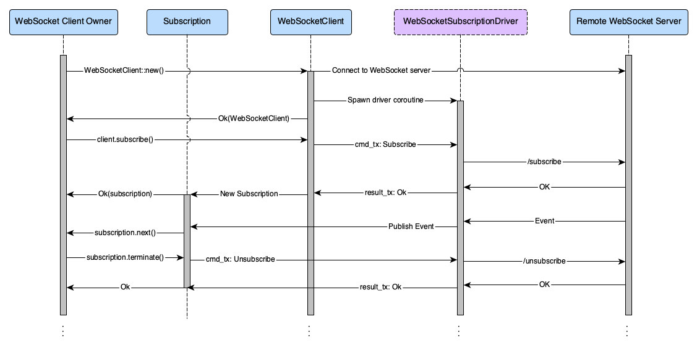

# ADR 008: RPC Client Event Subscription Mechanism

## Changelog

* 2020-07-23: Initial draft

## Context

The [Tendermint Light Client](../../light-client/) is one of many important
applications that will make use of the [RPC client](../../rpc/) to query
Tendermint full nodes for information relating to the blockchain.

Tendermint servers (e.g. full nodes) provide an [event
subscription][tm-event-subs] RPC endpoint to allow clients to receive
notifications of specific events as they happen (currently via a WebSockets
connection). We need to expose this subscription mechanism through the RPC client.

In order to achieve this, we need:

1. An ergonomic interface for the RPC client that allows developers to subscribe
   to events produced by specific queries. Specifically, this interface must:
   1. Offer **subscription** functionality, where:
      1. A single **subscription** takes place to the **events** produced by a
         **query** (the [PEG] for which, at the time of this writing, is located
         [here][query-peg]).
      2. Callers must be able to create multiple distinct subscriptions.
      3. A subscription must offer an interface to allow for iteration over
         incoming events only relevant to that subscription (i.e. it should
         produce an **event stream**).
      4. It must be possible to, from outside of the RPC client, receive events
         from multiple subscriptions' event streams concurrently without
         interfering with/blocking each other.
      5. It must be possible to, from outside of the RPC client, handle
         subscriptions' event streams without blocking other RPC operations.
   2. Offer the ability to **unsubscribe** from specific queries (i.e. to
      terminate specific subscriptions).
2. An appropriate concurrency model for drivers of the transport layer that
   allows the transport layer to operate independently of consumers of
   subscriptions. This is so that consumers don't block transport layer
   activities and vice-versa.

## Decision

### Assumptions

* All blocking operations that deal with I/O must be `async`.
* We will not be ["de-asyncifying" the RPC][issue-318] and will rather, in a
  future ADR, propose a synchronous architecture as well should we need one.

### Proposed Entities and Relationships

The entities in the diagram below are described in the following subsections.


### `Event`

In terms of the subscription interface, this is ultimately what the end user is
most interested in obtaining. The `Event` type's structure is dictated by the
Tendermint RPC:

```rust
pub struct Event {
    /// The query that produced the event.
    pub query: String,
    /// The data associated with the event (determines its `EventType`).
    pub data: EventData,
    /// Event type and attributes map.
    pub events: Option<HashMap<String, Vec<String>>>,
}

pub enum EventData {
    NewBlock {
        block: Option<Block>,
        result_begin_block: Option<BeginBlock>,
        result_end_block: Option<EndBlock>,
    },
    Tx {
        tx_result: TxResult,
    },
    // ...
}
```

### `Subscription`

A `Subscription` here is envisaged as an entity that implements the
[Stream][futures-stream] trait, allowing its owner to asynchronously iterate
through all of the relevant incoming events. Use of such a subscription should
be as simple as:

```rust
while let Some(result_event) = subscription.next().await {
   match result_event {
      Ok(event) => { /* handle event */ },
      Err(e) => { /* terminate subscription and report error */ },
   }
}

// Terminate the subscription (i.e. unsubscribe and consume it).
// Since a `Subscription` could be moved to and consumed in any asynchronous
// context (and a distinct context to the original client entity that created
// it), it would make sense that **unsubscribing** should be accessible from
// that same context.
subscription.terminate().await.unwrap();
```

Once [asynchronous destructors][async-drop] are available in Rust, the
`terminate` method should no longer be necessary.

For efficient routing of events to `Subscription`s, each `Subscription` should
have some kind of unique identifier associated with it (a `SubscriptionId`).
Each `Subscription` relates only to a single [`Query`](#query). Therefore, its
publicly accessible fields may resemble the following:

```rust
pub struct Subscription {
    pub id: SubscriptionId,
    pub query: Query,
    // ... other fields to help facilitate inter-task comms ...
}
```

#### Buffering of Events

Since the rate at which events could be produced by the remote RPC endpoint may
differ from the rate at which the client process them, we need to buffer
incoming events in a `Subscription`.

Under the hood, a `Subscription` is envisaged to make use of some kind of
**unbounded channel** to buffer incoming `Event`s, such as that provided by
[Tokio's `mpsc`][tokio-mpsc]. We don't propose the use of bounded channels yet
since they complicate the concurrency model significantly: we would need to
cater for cases where we encounter full channels and provide for conventional or
application-specific ways of dealing with those full channels (e.g. back-off, or
back-pressure).

#### Managing Multiple Simultaneous Subscriptions

There may come instances where clients would want to initiate multiple
subscriptions to different event types and consume them all from the same
context. Since the `Subscription` struct implements the
[`Stream`][futures-stream] trait, all of the [stream-related
functionality][futures-stream-mod] should enhance the ergonomics of working with
`Subscription`s.

For example, if you wanted to iterate through two subscriptions at the same
time, processing events in the order in which they are received by the client:

```rust
use futures::stream::select_all;

// `subs1` and `subs2` are `Subscription`s:
while let Some(res) = select_all(vec![subs1, subs2]).next().await {
    match res {
        Ok(event) => { /* handle event */ },
        Err(e) => { /* handle error */ },
    }
}
```

### Client Model

Users of the Tendermint RPC library may or may not want access to subscription
functionality. Since such functionality comes with additional overhead in terms
of resource usage and asynchronous task management, it would be optimal to
provide two separate client traits: one that only implements non-subscription
functionality, and one that only implements subscription functionality (where
clients could either implement one or both traits).

The interfaces of the two types of clients are envisaged as follows.

#### `Client`

This type of client would allow for interaction with all RPC endpoints except
those pertaining to subscription management. In our current implementation, this
client would only interact via the HTTP RPC endpoints (the `HttpClient` in the
entity diagram above).

**Note**: All `async` traits are facilitated by the use of [async-trait].

```rust
pub type Result<R> = std::result::Result<R, Error>;

#[async_trait]
pub trait Client {
    /// `/abci_info`: get information about the ABCI application.
    async fn abci_info(&self) -> Result<abci_info::AbciInfo>;

    /// `/abci_query`: query the ABCI application
    async fn abci_query<V>(
        &self,
        path: Option<abci::Path>,
        data: V,
        height: Option<Height>,
        prove: bool,
    ) -> Result<abci_query::AbciQuery>
    where
        V: Into<Vec<u8>> + Send;

    /// ...

    /// Perform a general request against the RPC endpoint
    async fn perform<R>(&self, request: R) -> Result<R::Response>
    where
        R: Request;
}
```

#### `SubscriptionClient`

A `SubscriptionClient` would be one that only provides access to subscription
functionality. In our current implementation, this client would interact with a
WebSocket connection to provide subscription functionality (the
`WebSocketClient` in the entity diagram above).

```rust
#[async_trait]
pub trait SubscriptionClient {
    /// `/subscribe`: subscribe to receive events produced by the given query.
    async fn subscribe(&mut self, query: Query) -> Result<Subscription>;
}
```

### Client Implementations

We envisage 2 distinct client implementations at this point:

* `HttpClient`, which only implements [`Client`](#client) (over HTTP).
* `WebSocketClient`, which will implement [`Client`](#client) and
  [`SubscriptionClient`](#subscriptionclient) (over a WebSocket connection).

#### Handle-Driver Concurrency Model

Depending on the underlying transport, a client may need a **transport driver**
running in an asynchronous context. As in the example of a WebSocket connection,
the rate at which one interacts with the WebSocket connection may differ to the
rate at which one interacts with `Event`s being produced by a `Subscription`, so
they necessarily need to run concurrently in different contexts.

Implementation of such a transport driver is transport-specific. Short-lived
request/response interactions (such as HTTP) would not require such a transport
driver, whereas a WebSocket connection would.

In cases where a driver is necessary, the client implementation would have to
become a **handle** to the driver, facilitating communication with it across
asynchronous tasks.

A rough sketch of the interaction model between the different components
envisaged to make up the subscription subsystem is shown in the following
sequence diagram.



### `Query`

It is proposed that, using a *builder pattern*, we implement a subscription
`Query` interface that implements the full [query PEG][query-peg] provided by
the Go implementation of the RPC client. This would allow for compile-time
validation of queries.

The desired interface for constructing a query would look as follows:

```rust
// tm.event='NewBlock'
let query = Query::from(EventType::NewBlock);

// tm.event='Tx' AND tx.hash='XYZ'
let query = Query::from(EventType::Tx).and_eq("tx.hash", "XYZ");

// tm.event='Tx' AND tx.height=5
let query = Query::from(EventType::Tx).and_eq("tx.height", 5);
```

This interface could be implemented along the following lines.

```rust
// Query would only have constructors that either specified an event type
// (corresponding to a `tm.event='eventtype'` query) or a condition. There must
// be no constructor that allows for construction of an empty query.
pub struct Query {
    // A query can only match zero or one type of event.
    event_type: Option<EventType>,
    // A query can contain zero or more conditions.
    conditions: Vec<Condition>,
}

impl From<EventType> for Query {
    fn from(event_type: EventType) -> Self {
        Self {
            event_type: Some(event_type),
            conditions: Vec::new(),
        }
    }
}

impl Query {
    // An example of a constructor for `Operation::Eq`.
    pub fn eq(key: &str, value: impl Into<Operand>) -> Self {
        Self {
            event_type: None,
            conditions: vec![Condition::new(key, Operation::Eq(value.into()))],
        }
    }

    // ...

    // Allows for a simple builder pattern.
    pub fn and_eq(mut self, key: &str, value: impl Into<Operand>) -> Self {
        self.conditions.push(Condition::new(key, Operation::Eq(value.into())));
        self
    }

    // ...
}

// Derived from https://github.com/tendermint/tendermint/blob/main/types/events.go
pub enum EventType {
    NewBlock,
    NewBlockHeader,
    NewEvidence,
    Tx,
    ValidatorSetUpdates,
}

// A condition specifies a key (first parameter) and, depending on the
// operation, an value which is an operand of some kind.
pub enum Condition {
    // Equals
    Eq(String, Operand),
    // Less than
    Lt(String, Operand),
    // Less than or equal to
    Lte(String, Operand),
    // Greater than
    Gt(String, Operand),
    // Greater than or equal to
    Gte(String, Operand),
    // Contains (to check if a key contains a certain sub-string)
    Contains(String, String),
    // Exists (to check if a key exists)
    Exists(String),
}

// According to https://docs.tendermint.com/v0.34/rpc/#/Websocket/subscribe,
// an operand can be a string, number, date or time. We differentiate here
// between integer and floating point numbers.
//
// It would be most useful to implement `From` traits for each of the different
// operand types to the `Operand` enum, as this would improve ergonomics.
pub enum Operand {
    String(String),
    Signed(i64),
    Unsigned(u64),
    Float(f64),
    Date(chrono::Date),
    DateTime(chrono::DateTime),
}
```

### Subscription Tracking and Routing

Internally, a `SubscriptionRouter` is proposed that uses a `HashMap` to keep
track of all of the queries relating to a particular client.

```rust
pub struct SubscriptionRouter {
    // A map of queries -> (map of subscription IDs -> result event tx channels)
    subscriptions: HashMap<String, HashMap<String, SubscriptionTx>>,
}
```

At present, Tendermint includes the ID of the subscription relating to a
particular event in the JSON-RPC message, and so this data structure is optimal
for such a configuration. This will necessarily change if Tendermint's WebSocket
server [drops subscription IDs from events][tendermint-2949], which is likely if
we want to conform more strictly to the [JSON-RPC standard for
notifications][jsonrpc-notifications].

### Handling Mixed Events and Responses

Since a full client needs to implement both the `Client` and
`SubscriptionClient` traits, for certain transports (like a WebSocket
connection) we could end up receiving a mixture of events from subscriptions
and responses to RPC requests. To disambiguate these different types of 
incoming messages, a simple mechanism is proposed for the
`WebSocketClientDriver` that keeps track of pending requests and only matures
them once it receives its corresponding response.

```rust
pub struct WebSocketClientDriver {
    // ...

    // Commands we've received but have not yet completed, indexed by their ID.
    // A Terminate command is executed immediately.
    pending_commands: HashMap<String, DriverCommand>,
}

// The different types of requests that the WebSocketClient can send to its
// driver.
//
// Each of SubscribeCommand, UnsubscribeCommand and SimpleRequestCommand keep
// a response channel that allows for the driver to send a response later on
// when it receives a relevant one.
enum DriverCommand {
    // Initiate a subscription request.
    Subscribe(SubscribeCommand),
    // Initiate an unsubscribe request.
    Unsubscribe(UnsubscribeCommand),
    // For non-subscription-related requests.
    SimpleRequest(SimpleRequestCommand),
    Terminate,
}
```

IDs of outgoing requests are randomly generated [UUIDv4] strings.

The logic here is as follows:

1. A call is made to `WebSocketClient::subscribe` or
   `WebSocketClient::perform`.
2. The client sends the relevant `DriverCommand` to its driver via its internal
   communication channel.
3. The driver receives the command, sends the relevant simple or subscription
   request, and keeps track of the command in its `pending_commands` member
   along with its ID. This allows the driver to continue handling outgoing 
   requests and incoming responses in the meantime.
4. If the driver receives a JSON-RPC message whose ID corresponds to an ID in
   its `pending_commands` member, it assumes that response is relevant to that
   command and sends back to the original caller by way of a channel stored in
   one of the `SubscribeCommand`, `UnsubscribeCommand` or
   `SimpleRequestCommand` structs. Failures are also communicated through this
   same mechanism.
5. The pending command is evicted from the `pending_commands` member.

## Status

Proposed

## Consequences

### Positive

* Provides relatively intuitive developer ergonomics (`Subscription` iteration
  to produce `Event`s).
* Mocking client functionality is relatively easy, allowing for a greater
  variety of testing (including simulating transport-level failures).

### Negative

* Requires an additional concurrent, potentially long-running `async` task to be
  concerned about (partially mitigated by the [handle-driver concurrency
  model](#handle-driver-concurrency-model)).

### Neutral

None

## References

* [\#313](https://github.com/informalsystems/tendermint-rs/issues/313)
* [\#311](https://github.com/informalsystems/tendermint-rs/issues/311)
* [\#458][pr-458]
* [Tendermint RPC subscription endpoint][tm-event-subs]

[tm-event-subs]: https://docs.tendermint.com/v0.34/rpc/#/Websocket/subscribe
[client]: https://github.com/informalsystems/tendermint-rs/blob/06ed36eaf7a74c0357b86d1d7450a2fec52ed6a0/rpc/src/client.rs#L20
[query-peg]: https://github.com/tendermint/tendermint/blob/98c595312af02037843b8fe74f0ee0625665448e/libs/pubsub/query/query.peg
[tm-go-query]: https://github.com/tendermint/tendermint/blob/98c595312af02037843b8fe74f0ee0625665448e/libs/pubsub/pubsub.go#L64
[PEG]: https://en.wikipedia.org/wiki/Parsing_expression_grammar
[futures-stream]: https://docs.rs/futures/*/futures/stream/trait.Stream.html
[pr-458]: https://github.com/informalsystems/tendermint-rs/pull/458
[issue-318]: https://github.com/informalsystems/tendermint-rs/issues/318
[tokio-sync]: https://docs.rs/tokio/*/tokio/sync/index.html
[async-trait]: https://docs.rs/async-trait/*/async_trait/index.html
[async-drop]: https://internals.rust-lang.org/t/asynchronous-destructors/11127
[tokio-mpsc]: https://docs.rs/tokio/*/tokio/sync/mpsc/index.html
[futures-stream-mod]: https://docs.rs/futures/*/futures/stream/index.html
[tendermint-2949]: https://github.com/tendermint/tendermint/issues/2949
[jsonrpc-notifications]: https://www.jsonrpc.org/specification#notification
[UUIDv4]: https://en.wikipedia.org/wiki/Universally_unique_identifier#Version_4_(random)
