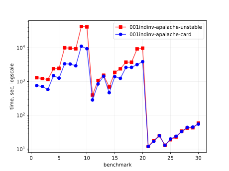
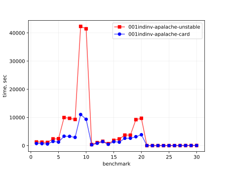
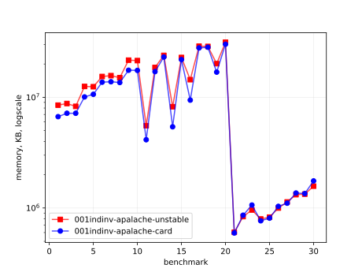
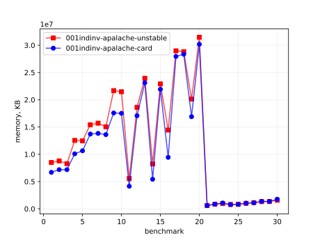
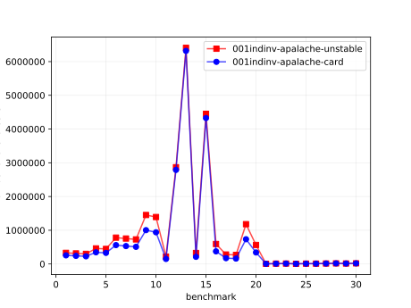
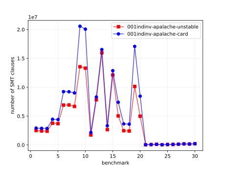

# Results of 001indinv-apalache

## 1. Awesome plots

### 1.1. Time (logarithmic scale)

### 1.2. Time (linear)

### 1.3. Memory (logarithmic scale)

### 1.4. Memory (linear)

### 1.5. Number of arena cells (linear)

### 1.6. Number of SMT clauses (linear)

## 2. Input parameters

no  |  filename       |  tool      |  timeout  |  init      |  inv                               |  next  |  args
----|-----------------|------------|-----------|------------|------------------------------------|--------|------------------------------
1   |  MC_n4_f1.tla   |  apalache  |  10h      |  TypedInv  |  TypedInv                          |        |  --length=1 --cinit=ConstInit
2   |  MC_n4_f2.tla   |  apalache  |  10h      |  TypedInv  |  TypedInv                          |        |  --length=1 --cinit=ConstInit
3   |  MC_n4_f3.tla   |  apalache  |  10h      |  TypedInv  |  TypedInv                          |        |  --length=1 --cinit=ConstInit
4   |  MC_n5_f1.tla   |  apalache  |  10h      |  TypedInv  |  TypedInv                          |        |  --length=1 --cinit=ConstInit
5   |  MC_n5_f2.tla   |  apalache  |  10h      |  TypedInv  |  TypedInv                          |        |  --length=1 --cinit=ConstInit
6   |  MC_n7_f2.tla   |  apalache  |  10h      |  TypedInv  |  TypedInv                          |        |  --length=1 --cinit=ConstInit
7   |  MC_n7_f3.tla   |  apalache  |  10h      |  TypedInv  |  TypedInv                          |        |  --length=1 --cinit=ConstInit
8   |  MC_n7_f4.tla   |  apalache  |  10h      |  TypedInv  |  TypedInv                          |        |  --length=1 --cinit=ConstInit
9   |  MC_n10_f3.tla  |  apalache  |  24h      |  TypedInv  |  TypedInv                          |        |  --length=1 --cinit=ConstInit
10  |  MC_n10_f4.tla  |  apalache  |  24h      |  TypedInv  |  TypedInv                          |        |  --length=1 --cinit=ConstInit
11  |  MC_n4_f1.tla   |  apalache  |  10h      |  TypedInv  |  Agreement                         |        |  --length=0 --cinit=ConstInit
12  |  MC_n4_f2.tla   |  apalache  |  10h      |  TypedInv  |  AgreementOrEquivocationOrAmnesia  |        |  --length=0 --cinit=ConstInit
13  |  MC_n4_f3.tla   |  apalache  |  10h      |  TypedInv  |  AgreementOrEquivocationOrAmnesia  |        |  --length=0 --cinit=ConstInit
14  |  MC_n5_f1.tla   |  apalache  |  10h      |  TypedInv  |  Agreement                         |        |  --length=0 --cinit=ConstInit
15  |  MC_n5_f2.tla   |  apalache  |  10h      |  TypedInv  |  AgreementOrEquivocationOrAmnesia  |        |  --length=0 --cinit=ConstInit
16  |  MC_n7_f2.tla   |  apalache  |  10h      |  TypedInv  |  Agreement                         |        |  --length=0 --cinit=ConstInit
17  |  MC_n7_f3.tla   |  apalache  |  10h      |  TypedInv  |  AgreementOrEquivocationOrAmnesia  |        |  --length=0 --cinit=ConstInit
18  |  MC_n7_f4.tla   |  apalache  |  10h      |  TypedInv  |  AgreementOrEquivocationOrAmnesia  |        |  --length=0 --cinit=ConstInit
19  |  MC_n10_f3.tla  |  apalache  |  24h      |  TypedInv  |  Agreement                         |        |  --length=0 --cinit=ConstInit
20  |  MC_n10_f4.tla  |  apalache  |  24h      |  TypedInv  |  AgreementOrEquivocationOrAmnesia  |        |  --length=0 --cinit=ConstInit
21  |  MC_n4_f1.tla   |  apalache  |  10h      |  Init      |  TypedInv                          |        |  --length=0 --cinit=ConstInit
22  |  MC_n4_f2.tla   |  apalache  |  10h      |  Init      |  TypedInv                          |        |  --length=0 --cinit=ConstInit
23  |  MC_n4_f3.tla   |  apalache  |  10h      |  Init      |  TypedInv                          |        |  --length=0 --cinit=ConstInit
24  |  MC_n5_f1.tla   |  apalache  |  10h      |  Init      |  TypedInv                          |        |  --length=0 --cinit=ConstInit
25  |  MC_n5_f2.tla   |  apalache  |  10h      |  Init      |  TypedInv                          |        |  --length=0 --cinit=ConstInit
26  |  MC_n7_f2.tla   |  apalache  |  10h      |  Init      |  TypedInv                          |        |  --length=0 --cinit=ConstInit
27  |  MC_n7_f3.tla   |  apalache  |  10h      |  Init      |  TypedInv                          |        |  --length=0 --cinit=ConstInit
28  |  MC_n7_f4.tla   |  apalache  |  10h      |  Init      |  TypedInv                          |        |  --length=0 --cinit=ConstInit
29  |  MC_n10_f3.tla  |  apalache  |  24h      |  Init      |  TypedInv                          |        |  --length=0 --cinit=ConstInit
30  |  MC_n10_f4.tla  |  apalache  |  24h      |  Init      |  TypedInv                          |        |  --length=0 --cinit=ConstInit

## 3. Detailed results: 001indinv-apalache-unstable.csv

01:no  |  02:tool   |  03:status  |  04:time_sec  |  05:depth  |  05:mem_kb  |  10:ninit_trans  |  11:ninit_trans  |  12:ncells  |  13:nclauses  |  14:navg_clause_len
-------|------------|-------------|---------------|------------|-------------|------------------|------------------|-------------|---------------|--------------------
1      |  apalache  |  NoError    |  21m          |  1         |  8.0GB      |  0               |  0               |  330K       |  2.0M         |  25
2      |  apalache  |  NoError    |  20m          |  1         |  8.0GB      |  0               |  0               |  313K       |  2.0M         |  25
3      |  apalache  |  NoError    |  19m          |  1         |  7.0GB      |  0               |  0               |  299K       |  2.0M         |  25
4      |  apalache  |  NoError    |  39m          |  1         |  11GB       |  0               |  0               |  461K       |  3.0M         |  26
5      |  apalache  |  NoError    |  40m          |  1         |  11GB       |  0               |  0               |  445K       |  3.0M         |  27
6      |  apalache  |  NoError    |  2h02m        |  1         |  14GB       |  0               |  0               |  780K       |  6.0M         |  28
7      |  apalache  |  NoError    |  2h02m        |  1         |  14GB       |  0               |  0               |  754K       |  6.0M         |  29
8      |  apalache  |  NoError    |  2h02m        |  1         |  14GB       |  0               |  0               |  728K       |  6.0M         |  29
9      |  apalache  |  NoError    |  11h          |  1         |  20GB       |  0               |  0               |  1.0M       |  13M          |  31
10     |  apalache  |  NoError    |  11h          |  1         |  20GB       |  0               |  0               |  1.0M       |  13M          |  32
11     |  apalache  |  NoError    |  6m06s        |  0         |  5.0GB      |  0               |  0               |  219K       |  1.0M         |  20
12     |  apalache  |  NoError    |  17m          |  0         |  17GB       |  0               |  0               |  2.0M       |  7.0M         |  11
13     |  apalache  |  NoError    |  25m          |  0         |  22GB       |  0               |  0               |  6.0M       |  15M          |  10
14     |  apalache  |  NoError    |  11m          |  0         |  7.0GB      |  0               |  0               |  326K       |  2.0M         |  22
15     |  apalache  |  NoError    |  31m          |  0         |  21GB       |  0               |  0               |  4.0M       |  12M          |  11
16     |  apalache  |  NoError    |  39m          |  0         |  13GB       |  0               |  0               |  592K       |  5.0M         |  24
17     |  apalache  |  Fail       |  1h01m        |  0         |  27GB       |  0               |  0               |  280K       |  2.0M         |  24
18     |  apalache  |  Fail       |  1h01m        |  0         |  27GB       |  0               |  0               |  268K       |  2.0M         |  24
19     |  apalache  |  NoError    |  2h02m        |  0         |  19GB       |  0               |  0               |  1.0M       |  10M          |  27
20     |  apalache  |  Fail       |  2h02m        |  0         |  30GB       |  0               |  0               |  564K       |  4.0M         |  28
21     |  apalache  |  NoError    |  12s          |  0         |  588MB      |  0               |  0               |  5.0K       |  33K          |  23
22     |  apalache  |  NoError    |  18s          |  0         |  816MB      |  0               |  0               |  9.0K       |  67K          |  23
23     |  apalache  |  NoError    |  25s          |  0         |  937MB      |  0               |  0               |  12K        |  103K         |  22
24     |  apalache  |  NoError    |  13s          |  0         |  776MB      |  0               |  0               |  5.0K       |  36K          |  25
25     |  apalache  |  NoError    |  19s          |  0         |  807MB      |  0               |  0               |  9.0K       |  73K          |  25
26     |  apalache  |  NoError    |  23s          |  0         |  976MB      |  0               |  0               |  10K        |  84K          |  29
27     |  apalache  |  NoError    |  34s          |  0         |  1.0GB      |  0               |  0               |  14K        |  129K         |  28
28     |  apalache  |  NoError    |  42s          |  0         |  1.0GB      |  0               |  0               |  18K        |  179K         |  27
29     |  apalache  |  NoError    |  43s          |  0         |  1.0GB      |  0               |  0               |  14K        |  154K         |  32
30     |  apalache  |  NoError    |  59s          |  0         |  1.0GB      |  0               |  0               |  18K        |  211K         |  31

## 4. Detailed results: 001indinv-apalache-card.csv

01:no  |  02:tool   |  03:status  |  04:time_sec  |  05:depth  |  05:mem_kb  |  10:ninit_trans  |  11:ninit_trans  |  12:ncells  |  13:nclauses  |  14:navg_clause_len
-------|------------|-------------|---------------|------------|-------------|------------------|------------------|-------------|---------------|--------------------
1      |  apalache  |  NoError    |  12m          |  1         |  6.0GB      |  0               |  0               |  255K       |  2.0M         |  20
2      |  apalache  |  NoError    |  11m          |  1         |  6.0GB      |  0               |  0               |  241K       |  2.0M         |  21
3      |  apalache  |  NoError    |  9m09s        |  1         |  6.0GB      |  0               |  0               |  227K       |  2.0M         |  21
4      |  apalache  |  NoError    |  24m          |  1         |  9.0GB      |  0               |  0               |  346K       |  4.0M         |  21
5      |  apalache  |  NoError    |  20m          |  1         |  10GB       |  0               |  0               |  329K       |  4.0M         |  21
6      |  apalache  |  NoError    |  55m          |  1         |  13GB       |  0               |  0               |  560K       |  9.0M         |  20
7      |  apalache  |  NoError    |  54m          |  1         |  13GB       |  0               |  0               |  531K       |  9.0M         |  21
8      |  apalache  |  NoError    |  48m          |  1         |  12GB       |  0               |  0               |  508K       |  9.0M         |  21
9      |  apalache  |  NoError    |  3h03m        |  1         |  16GB       |  0               |  0               |  1.0M       |  20M          |  20
10     |  apalache  |  NoError    |  2h02m        |  1         |  16GB       |  0               |  0               |  940K       |  20M          |  20
11     |  apalache  |  NoError    |  4m04s        |  0         |  3.0GB      |  0               |  0               |  148K       |  2.0M         |  17
12     |  apalache  |  NoError    |  14m          |  0         |  16GB       |  0               |  0               |  2.0M       |  8.0M         |  10
13     |  apalache  |  NoError    |  23m          |  0         |  22GB       |  0               |  0               |  6.0M       |  16M          |  10
14     |  apalache  |  NoError    |  7m07s        |  0         |  5.0GB      |  0               |  0               |  212K       |  3.0M         |  17
15     |  apalache  |  NoError    |  23m          |  0         |  20GB       |  0               |  0               |  4.0M       |  12M          |  10
16     |  apalache  |  NoError    |  20m          |  0         |  8.0GB      |  0               |  0               |  374K       |  7.0M         |  16
17     |  apalache  |  Fail       |  43m          |  0         |  26GB       |  0               |  0               |  172K       |  3.0M         |  17
18     |  apalache  |  Fail       |  43m          |  0         |  27GB       |  0               |  0               |  160K       |  3.0M         |  17
19     |  apalache  |  NoError    |  52m          |  0         |  16GB       |  0               |  0               |  734K       |  17M          |  16
20     |  apalache  |  Fail       |  1h01m        |  0         |  28GB       |  0               |  0               |  341K       |  8.0M         |  16
21     |  apalache  |  NoError    |  12s          |  0         |  580MB      |  0               |  0               |  5.0K       |  33K          |  23
22     |  apalache  |  NoError    |  17s          |  0         |  840MB      |  0               |  0               |  9.0K       |  68K          |  23
23     |  apalache  |  NoError    |  25s          |  0         |  1.0GB      |  0               |  0               |  12K        |  104K         |  22
24     |  apalache  |  NoError    |  13s          |  0         |  748MB      |  0               |  0               |  5.0K       |  36K          |  25
25     |  apalache  |  NoError    |  20s          |  0         |  791MB      |  0               |  0               |  9.0K       |  73K          |  25
26     |  apalache  |  NoError    |  24s          |  0         |  1009MB     |  0               |  0               |  10K        |  85K          |  28
27     |  apalache  |  NoError    |  33s          |  0         |  1.0GB      |  0               |  0               |  14K        |  131K         |  28
28     |  apalache  |  NoError    |  44s          |  0         |  1.0GB      |  0               |  0               |  18K        |  180K         |  27
29     |  apalache  |  NoError    |  45s          |  0         |  1.0GB      |  0               |  0               |  14K        |  155K         |  32
30     |  apalache  |  NoError    |  55s          |  0         |  1.0GB      |  0               |  0               |  18K        |  213K         |  31
