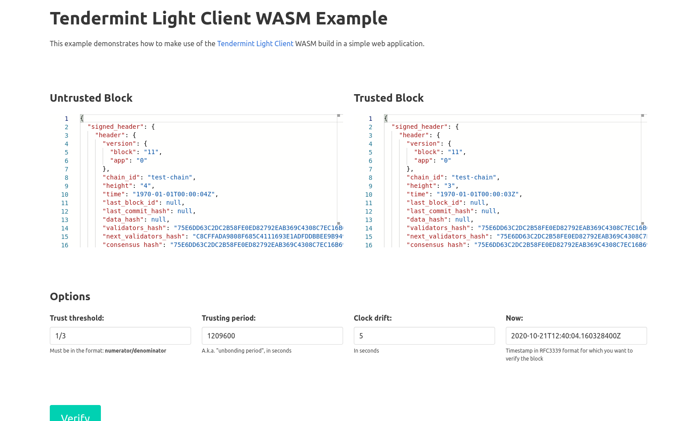
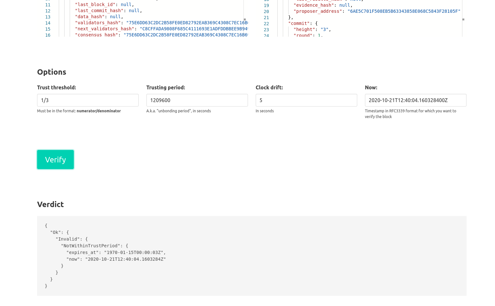

# Web-Based Light Client Verification

This folder contains a simple *example* web application demonstrating
Tendermint Light Client verification.

## Requirements

* Rust stable latest
* NodeJS (tested with v14.15.5)
* [wasm-pack]

## Try it out

You first need to build a few things before you can try this example out
locally.

### Step 1: Building the WASM binary

From the [`light-client-js` folder](../../):

```bash
wasm-pack build
```

This will build our WASM binary and JavaScript/TypeScript wrappers and place
them into a `pkg` directory.

### Step 2: Build/run the example

From this directory (`light-client-js/examples/verifier-web`):

```bash
# Install all dependencies
npm install

# Build/start the example app
npm run start
```

This should build the example and start a server at http://localhost:8080

### Step 3: Input your data

When you open up at http://localhost:8080, you should see something like the
following:



Copy/paste the JSON representation of a trusted block alongside that of the
untrusted block you wish to verify into the supplied editors. Configure your
desired Light Client parameters, as well as the timestamp at which you want to
check whether the untrusted block is trustworthy, and click the **Verify**
button.

This will show you the raw JSON object received back from the verifier.



## Limitations

1. This example only demonstrates *verification*, and is pretty manual right
   now (you must manually copy/paste the JSON representations of untrusted and
   trusted blocks, and supply options/timestamps manually). No network I/O
   happens here, so bring your own I/O to fetch light blocks.
2. The WASM binary built in step 1 only works for bundled web applications
   (e.g. using [webpack]). 

[wasm-pack]: https://rustwasm.github.io/docs/wasm-pack/introduction.html
[webpack]: https://webpack.js.org/
