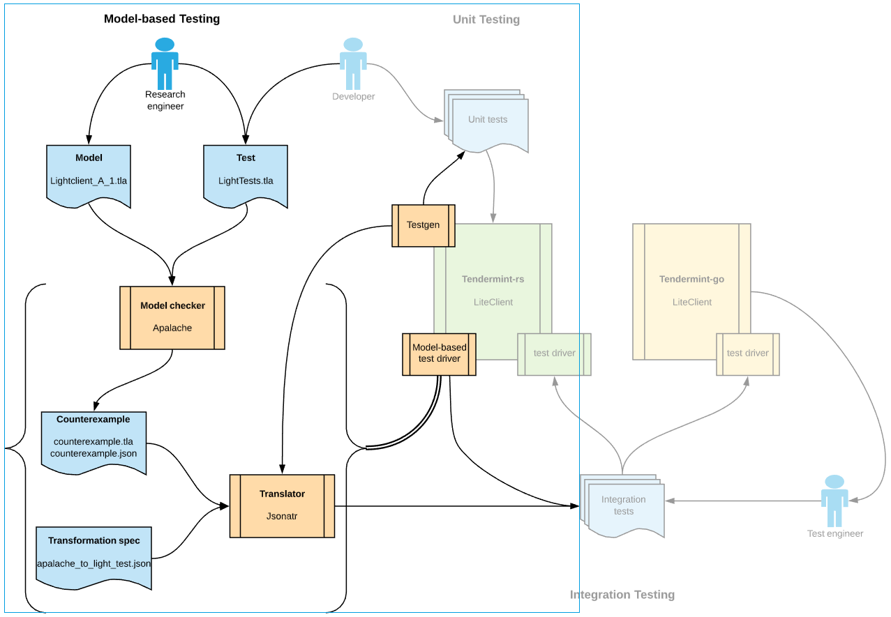

# Model-based testing with TLA+ and Apalache

We present our instantiation of model-based testing (MBT) using the TLA+ modeling language and the Apalache model checker. In our work we have created the infrastructure that facilitates model-based testing, and makes it appealing and beneficial for software developers to apply in their everyday development practice -- much more so than the standard integration testing with manually written tests that we've employed previously.

Our model-based testing procedure finds its rightful place in the verification-driven development process (VDD) we apply at Informal Systems. More concretely, we use it as an alternative approach to integration testing of the implementation in the Rust programming language of the fault-tolerant distributed consensus protocol named Tendermint. In the VDD process, we start with the semi-formal English language description of the protocol, which is then formally specified in TLA+, and verified by our Apalache model checker. The TLA+ specification is used as a reference model for clarifying misunderstanding both at the English language level, and at the level of the concrete implementation in Rust. Model-based tests are expressed in pure TLA+, and represent simple assertions on the computation history the user wants to examine. Consider the model-based test below:

```tla+
Test2NoSuccess ==
    /\ state = "finishedSuccess"
    /\ \E s1, s2 \in DOMAIN history:
       /\ s1 /= s2
       /\ history[s1].verdict /= "SUCCESS"
       /\ history[s2].verdict /= "SUCCESS"

```

This is the model-based test of the Tendermint LightClient sub-protocol, which is used to establish a trust in a blockchain block retrieved from an untrusted source. The test describes a computation history in which the protocol execution, despite passing through two distinct intermediate states with unsuccessful block verification, still finishes successfully. This model-based test is then used to automatically generate and execute the complete integration test for the Tendermint LightClient protocol: e.g., in a Tendermint network with 4 validators these 6 lines of TLA+ are translated to more than 500 lines of the JSON integration test with all necessary details: private and public keys, signatures, timestamps, etc.

In our presentation we would like to convey three main messages on model-based testing, which we describe below.

## Model-based testing with TLA+ is easy to understand, and can be successfully applied in the industry to provide correctness guarantees for real-world software.

In our initial experience of implementing and applying MBT, we find quite appealing its simplicity for the end user, being it a researcher or a developer. The model-based tests are quite abstract and concise; they can precisely describe what behavior needs to be tested. At the same time, in sharp contrast to standard integration tests, they leave a lot of details unspecified. An important feature of MBT is that these missing details will be instantiated in different ways with each run of the model-based test; moreover, this behavior can be easily employed to _exhaustively_ test all scenarios falling under the abstract test. In the above example, the intermediate results are only restricted to be unsuccessful, but concrete verification errors are left open. And the model checker will indeed instantiate for each run different combinations of failures: due to the blockchain block falling out of the trusting period, not enough trust in the validator set, signature validation errors, etc.

One of the main reasons for the Tendermint modeling and model-based testing being successfully implemented and accepted within our teams is the rich syntax and semantics of the TLA+ language. TLA+ allowed us to concisely model the complex aspects of the Tendermint protocol, as well as to express correctness properties and tests about it. In particular, even for developers without a prior exposure to TLA+, following the models written by our researchers has helped to clarify the protocol abstractions before diving into the implementation, thus avoiding the painful experience and countless hours of correcting them when the implementation is already done.


## Substantial infrastructure is necessary for model-based testing, but the complexity is reasonable.

Some infrastructure naturally needs to be implemented in order to apply MBT. The good news is that a lot of that infrastructure is reusable: some for different components of the same product, some for different products or even different companies. Within our first MBT project we have implemented the following infrastructure components, highlighted in the figure:

* Apalache model checker extension for providing JSON input/output (reusable globally);
* JSON Artifact Translator (Jsonatr),  which, with the help of a transformation specification, maps an abstract counterexample produced by the model checker, into the concrete integration test (the tool reusable globally, the transformation spec -- for a specific product);
* Test generator (Testgen), which plays the role of a _concretization function_, mapping abstract model states into concrete implementation states (reusable for multiple products sharing the same data structures);
* Model-based test driver, which orchestrates the above infrastructure components to run them within the standard continuous integration (CI) framework; for Rust this is done via the standard `cargo test` command (used only for a specific product/component, but quite minimalistic).

Implementation of the above infrastructure took us about 3 person-months of work, which is quite a reasonable cost taking into account the reusability of most of the components.

 


## MBT can serve as a "missing link" to synchronize formal specification and concrete implementation, and to connect academia and industry.

The original VDD process, while being highly successful as acknowledged both by our research and development teams, still lacks some necessary feedback loops. We have observed that after some time the English specification, the TLA+ model, and the concrete implementation start to diverge. Our initial experience with MBT suggests that it can successfully play the role of the missing link, providing feedback loops between the three levels of abstraction. In particular, the MBT has helped us to eliminate the growing divergence between the abstraction levels with the help of simple model-based tests.


